# Lecture 3.1: Introduction to Trees

## Table of Contents

- [Graphs](#graphs)
- [Trees](#trees)
    - [Common Tree Terminology](#common-tree-terminology)
- [How Trees Are Stored](#how-trees-are-stored)
- [Binary Trees](#binary-trees)
- [Binary Search Trees](#binary-search-trees)
- [Tree Traversals](#tree-traversals)
- [BST Operations](#bst-operations)
- [Deleting from a BST](#deleting-from-a-bst)
- [Key Takeaways](#key-takeaways)

---

## Graphs

A **graph** is a mathematical structure made up of:

- **Vertices**, also called **nodes**
    - Usually stores data.
    - In the Examples: A, B, C, D, E. 
- **Edges**, which connect nodes
    - Always connect two nodes.
    - Can store data.
    - In the Examples: solid lines between each nodes.
    - Can be **directed** or **undirected**.

**Example 1.1: Undirected Graph:**
- Edges do not have a specific direction
- Bidirectional (two-way street)
- Can go from A to B, and from B to A
- Example: Friends on social media. 

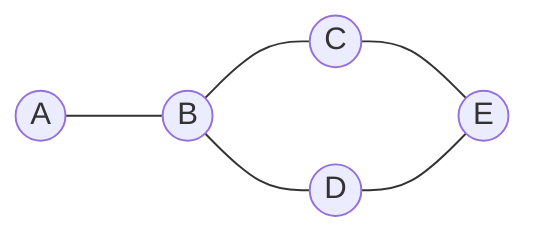

**Example 1.2: Directed Graph:**
- Edges have a specific direction
- Uni-directional (one-way street)
- Can go from A to B (`A -> B`), but not from B to A
- Example: Following someone on social media.

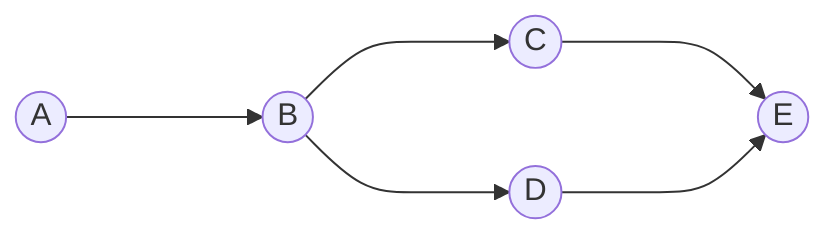

Graphs can represent many real-world relationships, such as:

- Dialogue options in a game
- Rooms of a building
- Parent and offspring connections, such as genealogy or phylogeny
- Social networks

---

## Trees

A **tree** is a special type of graph.

Requirements for a Tree:
- **No cycles** (cannot loop back to the same node).
- Exactly **one path** between any two given nodes.

**Example 2.1: Graph with Cycle:**

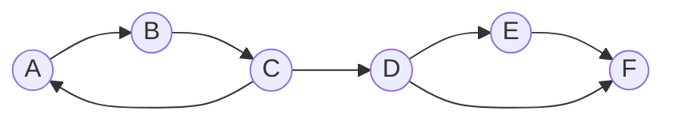

This graph violates both requirements:
    1. It has a cycle: `A → B → C → A`.
    2. It has more than one path between nodes D and F:
    ```
    D → F
    D → E → F
    ```

**Example 2.2: Graph without Cycle (Rooted Tree):**

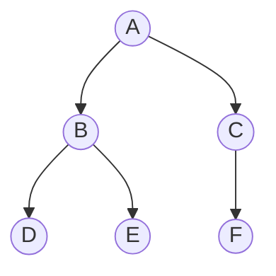

<br>

### Exercise 2.1
Which of the following are Trees?
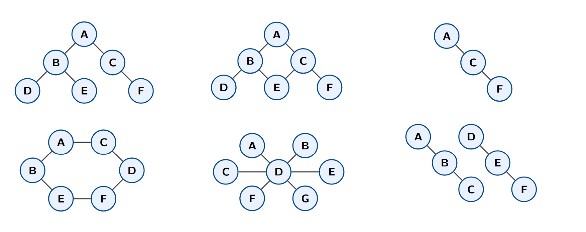

<details>
<summary> Click to show answer</summary>

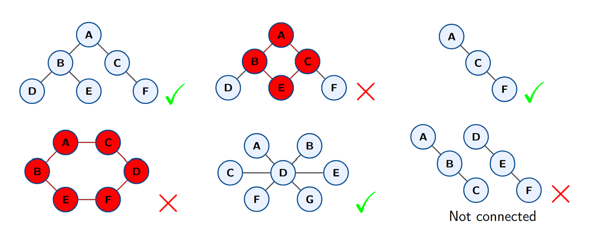

</details>

<br>

### Exercise 2.2
Which of the following examples are generally not best represented as a tree? Explain why.
- Dialogue options in a game
- Rooms of a building
- Genealogy or phylogeny
- Social networks
- File systems and hierarchies

<details>
<summary> Click to show answer</summary>
    
- Dialogue options in a game ✅
- ~~Rooms of a building~~
- Genealogy or phylogeny ✅
- ~~Social networks~~
- File systems and hierarchies ✅

**Why?**
- Rooms in a building: You might reach the same room through different hallways or doors.
- Social networks : Friendships or relationships can form cycles, and there may be many different paths (social groups) between two people.
</details>

---

## Common Tree Terminology

Trees often have:
- A **root**, meaning the whole tree descends from one root node.
- A **parent-child** structure.

We will use the following tree to introduce common tree terminology:

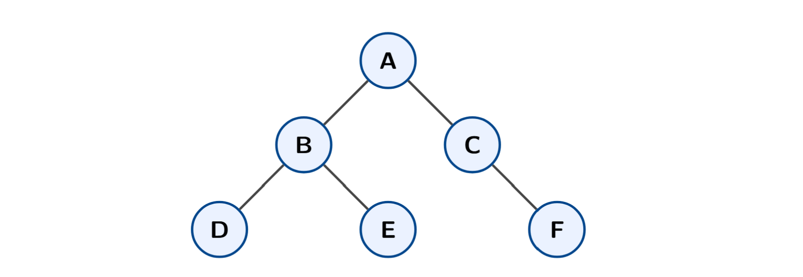

### Root

The **root** is the starting node of the tree.

> `A` is the root.

### Parent and Child

A **parent** is a node directly above another node.

A **child** is a node directly below another node.

> `A` is the parent of `B` and `C` $\approx$ `B` and `C` are children of `A`

> `B` is the parent of `D` and `E` $\approx$ `D` and `E` are children of `B`

> `C` is the parent of `F` $\approx$ `F` is the child of `F`

### Siblings

Nodes with the same parent are **siblings**.

> `B` and `C` are siblings because both have parent `A`

> `D` and `E` are siblings because both have parent `B`

### Leaf Nodes

A **leaf node** is a node with no children.

> `D`, `E`, and `F` are leaf nodes.

### Subtree

A **subtree** is a node and all of its descendants.

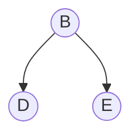

### Depth

The **depth** of a node is the number of edges between that node and the root.

> Depth of `A` = `0`

> Depth of `B` and `C` = `1`

> Depth of `D`, `E`, and `F` = `2`

### Height

The **height** of a node is the maximum number of edges between that node and one of its descendant leaf nodes.

The **height of the tree** is the height of the root.

> Height of `A` = `2`

> Height of `B` and `C` = `1`

> Height of `D`, `E`, and `F` = `0`

> Height of the tree = `2`
---

## How Trees Are Stored

There are multiple ways to store a tree.

### 1. Flat Representation

A tree can be stored as:

- A list or array of nodes with values
- A list of edges

Example:

```python
nodes = ["A", "B", "C", "D", "E", "F"]
edges = [
    ("A", "B"),
    ("A", "C"),
    ("B", "D"),
    ("B", "E"),
    ("C", "F"),
]
```

### 2. Recursive Data Structure

A common way to store trees is recursively. Each node stores:

- A key or value
- Pointers or references to its children

General tree node:

```python
class TreeNode:
    def __init__(self, key, value=None):
        self.key = key
        self.value = value
        self.children = []
```

---

## Binary Trees

**Binary** means **two**.

A **binary tree** is a tree where every node has **at most two children**.

Those children are usually called:

- The **left child**
- The **right child**

Example binary tree:


### Searching a Plain Binary Tree

If a binary tree has no ordering rule, searching it can take:

```text
O(n)
```

In the worst case, we may need to check every node. How can we do better?

---

## Binary Search Trees (BST)

A **binary search tree**, or **BST**, is a binary tree with one extra ordering rule.

For any node `X`:

1. `X.key` is greater than or equal to all keys in the left subtree of `X`
2. `X.key` is less than or equal to all keys in the right subtree of `X`

In short:

```text
left subtree <= node <= right subtree
```

This must be true for **every node** in the tree.

That also means every subtree must itself be a BST.

### Valid BST Example

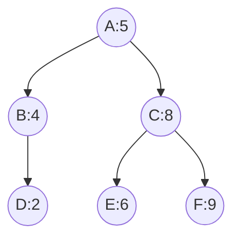

This is a BST because:

- Everything left of `A` (value = `5`) is `<= 5`
- Everything right of `5` is `>= 5`
- The same rule holds for every subtree

### Invalid BST Example

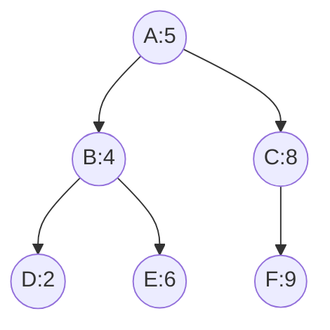

This is **not** a BST because `6` is in the left subtree of `5`, but `6 > 5`.

### A BST Can Be Unbalanced

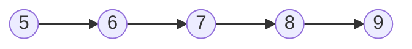

This is still a BST, but it is shaped like a linked list.

The BST property is about **ordering**, not balance.

---

## Tree Traversals

A **tree traversal** is a method for visiting every node in a tree.

There are three main depth-first traversals:

1. **In-order walk**
2. **Pre-order walk**
3. **Post-order walk**

Use this BST for the examples:


### In-Order Walk

In-order visits nodes in this order:

```text
left subtree → node → right subtree
```

For the example tree:

```text
2, 4, 5, 6, 8, 9
```

Algorithm:

```python
def traverse_in_order(node):
    if node is not None:
        traverse_in_order(node.left)
        print(node.key)
        traverse_in_order(node.right)
```

For a BST, in-order traversal gives the keys in sorted order.

### Pre-Order Walk

Pre-order visits nodes in this order:

```text
node → left subtree → right subtree
```

For the example tree:

```text
5, 4, 2, 8, 6, 9
```

Algorithm:

```python
def traverse_pre_order(node):
    if node is not None:
        print(node.key)
        traverse_pre_order(node.left)
        traverse_pre_order(node.right)
```

Pre-order is useful for structures where the parent should be handled before children, such as:

- File hierarchies
- Abstract syntax trees

### Post-Order Walk

Post-order visits nodes in this order:

```text
left subtree → right subtree → node
```

For the example tree:

```text
2, 4, 6, 9, 8, 5
```

Algorithm:

```python
def traverse_post_order(node):
    if node is not None:
        traverse_post_order(node.left)
        traverse_post_order(node.right)
        print(node.key)
```

Post-order is useful when children must be handled before the parent, such as safe deletion.

---

## BST Operations

Use this BST for the examples:


### Find the Minimum

To find the minimum value in a BST:

> Always go left.

```python
def get_minimum(node):
    while node.left is not None:
        node = node.left
    return node
```

For the example tree, the minimum is:

```text
2
```

### Find the Maximum

To find the maximum value in a BST:

> Always go right.

```python
def get_maximum(node):
    while node.right is not None:
        node = node.right
    return node
```

For the example tree, the maximum is:

```text
9
```

### Find / Contains

To check whether a value is in a BST:

1. Start at the root
2. If the current node matches the target, return `True`
3. If the target is smaller than the current node, go left
4. If the target is larger than the current node, go right
5. If you cannot continue in the needed direction, the value is not in the tree

Example question:

```text
Does this tree contain 3?
```

Search path:

```text
5 → 4 → 2 → stop
```

Since `3` is larger than `2`, we would need to go right from `2`. But `2` has no right child, so `3` is not in the tree.

Algorithm:

```python
def contains(node, target):
    while node is not None:
        if target == node.key:
            return True
        elif target < node.key:
            node = node.left
        else:
            node = node.right

    return False
```

### Find a Successor

The **successor** of a node is the next largest value.

Example questions:

```text
What is the successor of 4?
What is the successor of 5?
```

For the example tree:

```text
successor(4) = 5
successor(5) = 6
```

Rules:

1. If the node has a right subtree, the successor is the minimum node in that right subtree.
2. If the node does not have a right subtree and it is a left child, the successor is its parent.
3. Otherwise, move upward until you find an ancestor with a larger key.

---

## Deleting from a BST

Deleting a node from a BST has several cases.

### Case 1: The Node Is a Leaf

If the node has no children:

1. Delete the node
2. Set the parent’s pointer to `None`

Example: deleting `9` from this tree:


Result:


### Case 2: The Node Has One Child

If the node has only one child:

1. Replace the node with its child
2. Connect the parent directly to that child

Example: deleting `4` when `4` only has child `2`:


Result:

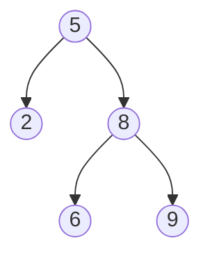

### Case 3: The Node Has Two Children

If the node has two children:

1. Find the node’s successor
2. Replace the node with the successor
3. If the successor had a right child, move that child into the successor’s old position

Example: deleting `5` from this tree:


The successor of `5` is `6`.

Result:

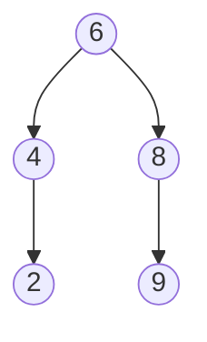

If the successor has a right child, that right child replaces the successor’s old position.

Example before deleting `5`:

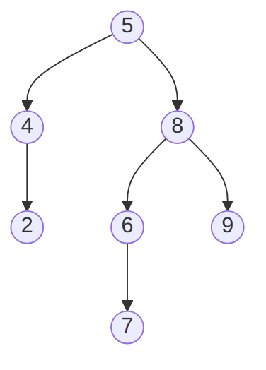

Result after replacing `5` with successor `6`:

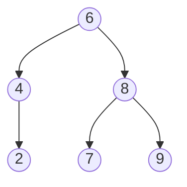

---

## Key Takeaways

- A graph is made of nodes and edges.
- A tree is a graph with no cycles and exactly one path between any two nodes.
- A rooted tree has parent-child relationships starting from a root.
- A binary tree allows each node to have at most two children.
- A binary search tree adds an ordering rule: `left <= node <= right`.
- Searching a plain binary tree can take `O(n)` time.
- BST operations depend on the height of the tree.
- In-order traversal of a BST gives sorted values.
- BST deletion has three cases: leaf, one child, and two children.
